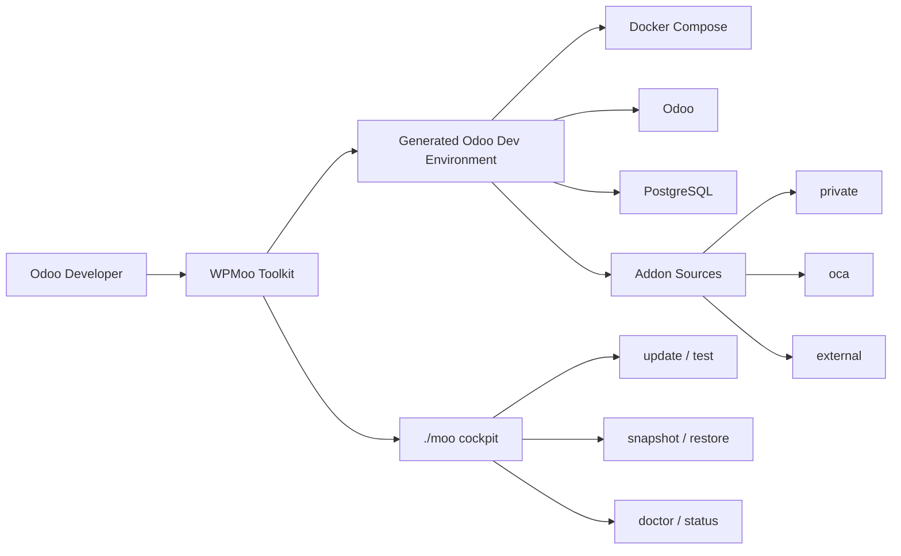

<p align="center">
  
</p>

[](https://github.com/wpmoo-org/wpmoo-toolkit/actions/workflows/ci.yml) [](https://github.com/wpmoo-org/wpmoo-toolkit) [](https://www.npmjs.com/package/@wpmoo/toolkit) [](https://codecov.io/gh/wpmoo-org/wpmoo-toolkit) [](LICENSE) [](https://github.com/wpmoo-org/wpmoo-toolkit) [](https://www.buymeacoffee.com/cangir) [](https://www.patreon.com/wpmoo)

<h1 align="center">WPMoo Toolkit</h1>

<p align="center">
  <strong>A calmer Odoo development workflow.</strong>
</p>

<p align="center">
  Repeatable Odoo dev environments, clean addon repos, and one cockpit for daily module work.
</p>

<p align="center">
  <a href="https://wpmoo.org"><strong>Website</strong></a>
  |
  <a href="https://wpmoo.org/guide/getting-started"><strong>Getting Started</strong></a>
  |
  <a href="https://wpmoo.org/reference/commands"><strong>Commands</strong></a>
</p>

---

## Quick Start

```bash
npx @wpmoo/toolkit
cd <product>_dev
./moo
```

No long Docker commands. No guessing addon paths. No mixing generated runtime files with product source code.

## Why Odoo Developers Use WPMoo

Every Odoo project tends to need the same setup work:

- Docker Compose files.
- Odoo and PostgreSQL runtime wiring.
- Private, OCA, and external addon source repositories.
- Module install, update, test, lint, and translation commands.
- Snapshots before risky changes.
- Diagnostics and recovery when generated files or databases drift.

WPMoo turns that recurring setup into one repeatable Odoo workflow.

## What You Get

| | |
| --- | --- |
| 🧱 **Repeatable environments** | Generate a predictable local Odoo setup for each product. |
| 📦 **Clean source layout** | Keep private, OCA, and external addon repos separated under `odoo/custom/src/`. |
| 🕹️ **Daily cockpit** | Start services, update modules, run tests, inspect logs, and manage snapshots. |
| 🧪 **Module workflow** | Install, update, test, lint, translate, add, and remove Odoo modules. |
| 🛟 **Safe recovery** | Use `status`, `doctor`, snapshots, restore, and safe reset deliberately. |
| 🤖 **Automation friendly** | Use the cockpit or direct commands in scripts, CI jobs, and agent workflows. |

## Daily Workflow

```bash
./moo start
./moo update my_module
./moo test my_module
./moo snapshot dev before-refactor
./moo doctor
```

## How It Works



The generated environment can be refreshed safely. Your source repositories stay clean and versioned separately.

## Clean Source Layout

```text
odoo/custom/src/
|-- private/
|-- oca/
`-- external/
```

Your product source stays clean. Generated runtime files can be refreshed safely.

## Learn More

- [WPMoo.org](https://wpmoo.org)
- [Getting Started](https://wpmoo.org/guide/getting-started)
- [Cockpit Guide](https://wpmoo.org/guide/cockpit)
- [Command Reference](https://wpmoo.org/reference/commands)
- [Generated Environments](https://wpmoo.org/reference/generated-environments)
- [Recovery Workflows](https://wpmoo.org/operations/recovery)

Legacy aliases are documented in the [command reference](https://wpmoo.org/reference/commands).

## Status

WPMoo Toolkit is pre-1.0 and under active development.

It is already useful for local Odoo development workflows, but command behavior and setup conventions may still change before the first stable release.

## License

WPMoo Toolkit is free software released under the [MIT License](LICENSE).

WPMoo Toolkit is independent from Odoo S.A. and is not affiliated with, endorsed by, or sponsored by Odoo S.A.
