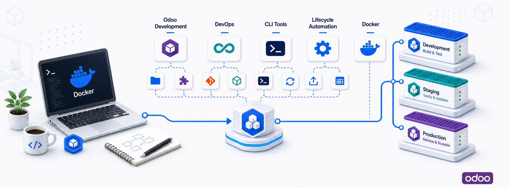

[](https://github.com/wpmoo-org/wpmoo-odoo/actions/workflows/ci.yml) [](https://github.com/wpmoo-org/wpmoo-odoo) [](https://www.npmjs.com/package/@wpmoo/odoo) [](https://coveralls.io/github/wpmoo-org/wpmoo-odoo?branch=main) [](https://codecov.io/gh/wpmoo-org/wpmoo-odoo) [](LICENSE) [](https://github.com/wpmoo-org/wpmoo-odoo) [](https://www.buymeacoffee.com/cangir) [](https://www.patreon.com/wpmoo)

# WPMoo Odoo

WPMoo Odoo is a development-first CLI for creating and operating Docker Compose
based Odoo environments with source repositories managed as Git submodules.

It gives Odoo teams a repeatable environment layout, a guided cockpit for daily
work, direct commands for automation, and recovery tools that refresh generated
files without touching product source code.

## Why WPMoo Odoo

- Create a local Odoo development environment from a dev repository and one or
  more source repositories.
- Keep product source repositories under `odoo/custom/src/private` as Git
  submodules pinned to the selected Odoo branch.
- Copy Docker Compose resources from the standalone
  `wpmoo-org/odoo-docker-compose` resource instead of embedding large runtime
  assets in the TypeScript package.
- Optionally copy project-local Agent Skills from `wpmoo-org/odoo-skills` into
  generated environments.
- Use either a guided terminal cockpit or direct CLI commands for the same
  lifecycle tasks.

## Requirements

- Node.js `>=20.17`
- Git
- Docker and Docker Compose for generated environment runtime commands
- Optional: GitHub CLI (`gh`) for repository discovery, repository creation, and
  deeper diagnostics

The wizard currently offers Odoo `19.0`, `18.0`, `17.0`, and `16.0`. The copied
Compose resource must include the matching `docker-compose_<version>.yml` file
for the selected branch.

Install GitHub CLI when you want WPMoo to discover your personal account and
organizations or create missing repositories from the interactive wizard:

```bash
brew install gh
gh auth login
```

## Quick Start

Run the guided wizard from a workspace directory:

```bash
npx @wpmoo/odoo
```

If the current directory is not already a WPMoo environment, the CLI opens the
create flow. It asks for the product slug, Odoo version, dev environment repo,
source repo URLs, optional extra source repos, project-local Agent Skills, and
empty repository initialization behavior.

For non-interactive usage:

```bash
npx @wpmoo/odoo create \
  --product odoo_sample_module \
  --odoo-version 19.0 \
  --dev-repo-url https://github.com/example-org/odoo_sample_module_dev.git \
  --source-repo-url https://github.com/example-org/odoo_sample_module.git \
  --init-empty-repos
```

Add multiple source repositories by repeating `--source-repo-url`:

```bash
npx @wpmoo/odoo create \
  --product odoo_sample_module \
  --dev-repo-url https://github.com/example-org/odoo_sample_module_dev.git \
  --source-repo-url https://github.com/example-org/odoo_sample_module.git \
  --source-addons odoo_sample_module,odoo_sample_module_portal \
  --source-repo-url git@github.com:example-org/odoo_sample_module_reports.git \
  --source-path odoo_sample_module_reports \
  --source-addons odoo_sample_module_reports
```

Preview planned files and commands without writing:

```bash
npx @wpmoo/odoo create \
  --product odoo_sample_module \
  --dev-repo-url https://github.com/example-org/odoo_sample_module_dev.git \
  --source-repo-url https://github.com/example-org/odoo_sample_module.git \
  --dry-run
```

## The Cockpit

Run the package with no command inside a generated environment:

```bash
npx @wpmoo/odoo
```

The cockpit starts with a fast environment status summary, then opens a compact
menu designed for repeated local work:

```text
Command palette /
Services
Modules
Database
Diagnostics
Repositories
Maintenance
Exit
```

The UI is intentionally practical rather than decorative:

- `Command palette /` searches slash commands such as `/test`, `/logs`,
  `/doctor`, and `/safe-reset`.
- Category menus group related tasks for scanability: services, modules,
  database, diagnostics, repositories, and maintenance.
- `Esc` returns from category menus to the top-level cockpit.
- Empty states explain the next action, such as adding a source repo before
  selecting a module.
- Risky commands such as stopping services, resetting databases, restoring
  snapshots, removing repos, removing modules, and safe reset ask for explicit
  confirmation.
- Guided prompts collect common arguments for daily actions, including module
  names, database names, test modes, tags, snapshot names, and POT output paths.

## Cockpit Command Map

| Category | Commands |
| --- | --- |
| Services | `start`, `stop`, `restart`, `logs`, `shell` |
| Modules | `install`, `update`, `test`, `lint`, `pot`, `add-module`, `remove-module` |
| Database | `psql`, `snapshot`, `restore-snapshot`, `resetdb` |
| Diagnostics | `status`, `doctor` |
| Repositories | `add-repo`, `remove-repo` |
| Maintenance | `safe-reset` |

Every cockpit action maps to a direct command, or to an equivalent management
command such as `/safe-reset` mapping to `reset`, for scripting and repeatable
terminal workflows.

## Direct Commands

```bash
npx @wpmoo/odoo --help
npx @wpmoo/odoo --version

npx @wpmoo/odoo status
npx @wpmoo/odoo doctor
npx @wpmoo/odoo add-repo --repo-url https://github.com/example-org/odoo_sample_module_reports.git
npx @wpmoo/odoo remove-repo --repo odoo_sample_module_reports
npx @wpmoo/odoo add-module --repo odoo_sample_module --module odoo_sample_module_base
npx @wpmoo/odoo remove-module --repo odoo_sample_module --module odoo_sample_module_base
npx @wpmoo/odoo reset

npx @wpmoo/odoo start
npx @wpmoo/odoo stop
npx @wpmoo/odoo restart
npx @wpmoo/odoo logs odoo
npx @wpmoo/odoo shell
npx @wpmoo/odoo psql postgres

npx @wpmoo/odoo install sale devel
npx @wpmoo/odoo update sale devel
npx @wpmoo/odoo test sale --db devel --mode update --tags /sale
npx @wpmoo/odoo lint
npx @wpmoo/odoo pot sale devel i18n/sale.pot

npx @wpmoo/odoo resetdb devel sale
npx @wpmoo/odoo snapshot devel before-update
npx @wpmoo/odoo restore-snapshot before-update devel
```

Daily action commands must be run from a generated environment root containing
`.wpmoo/odoo.json`. They delegate to fixed scripts under `./scripts`; they do
not search parent directories or run arbitrary script names.

## Generated Environment Layout

A generated environment is a separate Git repository, usually named
`<product>_dev`. Product source code stays in child source repositories.

```text
odoo_sample_module_dev/
|-- .wpmoo/
|   `-- odoo.json
|-- .env.example
|-- AGENTS.md
|-- README.md
|-- docs/
|   |-- appstore-release.md
|   `-- compose.md
|-- docker-compose_19.0.yml
|-- etc/
|-- moo
|-- odoo/
|   `-- custom/
|       `-- src/
|           `-- private/
|               `-- odoo_sample_module/
`-- scripts/
```

The metadata file `.wpmoo/odoo.json` records the product slug, selected Odoo
version, dev repo URL, source repos, engine, external resource refs, ports, and
template configuration. Status, doctor, daily actions, and safe reset use that
metadata instead of guessing from the filesystem.

## Daily `./moo` Commands

Generated environments include a local `./moo` dispatcher. It is the shortest
path for everyday Compose and Odoo work:

```bash
cp .env.example .env

./moo start
./moo logs odoo
./moo shell
./moo psql postgres
./moo restart
./moo stop

./moo install sale devel
./moo update sale devel
./moo test sale --db devel --mode update --tags /sale
./moo lint
./moo pot sale devel i18n/sale.pot

./moo snapshot devel before-update
./moo restore-snapshot before-update devel
./moo resetdb devel sale
```

Use `npx @wpmoo/odoo ...` for package/operator commands such as `create`,
`add-repo`, `remove-repo`, `add-module`, `remove-module`, `status`, `doctor`,
and `reset`. Use `./moo ...` inside a generated environment for local daily
Compose commands.

## Repository and Module Management

Add a source repository from the cockpit or direct command:

```bash
npx @wpmoo/odoo add-repo \
  --repo-url https://github.com/example-org/odoo_sample_module_reports.git \
  --init-empty-repos
```

When GitHub CLI is available and authenticated, the interactive flow can:

- detect the owner or organization from the current environment;
- suggest repository URLs;
- check whether the repository is accessible;
- create inaccessible repositories after confirmation;
- initialize empty repositories with the selected Odoo branch.

Add a minimal Odoo module skeleton to a source repository:

```bash
npx @wpmoo/odoo add-module \
  --repo odoo_sample_module \
  --module odoo_sample_module_base
```

Remove a module registration while keeping files:

```bash
npx @wpmoo/odoo remove-module \
  --repo odoo_sample_module \
  --module odoo_sample_module_base
```

Delete module files as well:

```bash
npx @wpmoo/odoo remove-module \
  --repo odoo_sample_module \
  --module odoo_sample_module_base \
  --delete-files
```

Remove a source repository submodule:

```bash
npx @wpmoo/odoo remove-repo --repo odoo_sample_module_reports
```

WPMoo refuses to remove a source repo submodule when that submodule has
uncommitted changes.

## Status, Doctor, and Recovery

`status` is fast and offline. It reads local metadata and files only:

```bash
npx @wpmoo/odoo status
```

It reports whether the environment is detected, which Odoo version is selected,
how many source repos are configured, how many module candidates are present,
which core files are missing, and the recommended next action.

`doctor` performs deeper checks:

```bash
npx @wpmoo/odoo doctor
```

It validates metadata, engine support, selected compose files, daily scripts,
source repo paths, `.env` ports, Docker CLI access, Docker Compose access, Git
submodule state, and GitHub CLI authentication when available.

Safe reset refreshes generated environment files without deleting product source
code:

```bash
npx @wpmoo/odoo reset
```

Safe reset updates generated files such as `.wpmoo/odoo.json`, `moo`,
`.gitignore`, `.env.example`, generated docs, compose assets, and optional
Agent Skills. It does not touch source repo folders under
`odoo/custom/src/private`, module source code, Git history, remotes, or
branches.

Recommended recovery pattern:

```bash
./moo snapshot devel before-reset
npx @wpmoo/odoo reset
npx @wpmoo/odoo doctor
./moo restore-snapshot before-reset devel
```

## External Resources

WPMoo Odoo keeps the package small by copying external resources into generated
environments:

```text
gh:wpmoo-org/odoo-docker-compose
gh:wpmoo-org/odoo-skills
```

Use the default resources:

```bash
npx @wpmoo/odoo create \
  --product odoo_sample_module \
  --source-repo-url https://github.com/example-org/odoo_sample_module.git \
  --agent-skills-template
```

Pin external resource refs:

```bash
npx @wpmoo/odoo create \
  --product odoo_sample_module \
  --source-repo-url https://github.com/example-org/odoo_sample_module.git \
  --compose-template-ref v0.1.0 \
  --agent-skills-template \
  --agent-skills-template-ref v0.1.0
```

Use local resource clones while developing the resource packages:

```bash
git clone https://github.com/wpmoo-org/odoo-docker-compose ../odoo-docker-compose
git clone https://github.com/wpmoo-org/odoo-skills ../odoo-skills

npx @wpmoo/odoo create \
  --engine compose \
  --compose-template-url ../odoo-docker-compose \
  --agent-skills-template \
  --agent-skills-template-url ../odoo-skills \
  --product odoo_sample_module \
  --source-repo-url https://github.com/example-org/odoo_sample_module.git
```

More detail: [External Resources](docs/external-resources.md).

## Verification

Run local package checks from the repository root:

```bash
npm run typecheck
npm test
npm run test:coverage
npm run build
```

Generated environment behavior is covered by the operator-facing matrix in
[Generated Environment Verification](docs/generated-environment-verification.md).

## Release

The normal release path uses the repository helper and GitHub Actions trusted
publishing:

```bash
npm run release:check
npm run typecheck
npm test
npm run build
VERSION="$(node -p "require('./package.json').version")"
git tag -a "v$VERSION" -m "Release v$VERSION"
git push origin "v$VERSION"
```

If `npm run release:check` bumps `package.json` and `package-lock.json`, commit
and push that version bump first, then rerun the release check before tagging.
Publishing is handled by the `Publish` workflow after the tag is pushed.

## Sponsoring

Support ongoing WPMoo development through recurring or one-time sponsorship:

<a href="https://www.buymeacoffee.com/cangir">
  
</a>&nbsp;&nbsp;&nbsp;&nbsp;&nbsp;&nbsp;
<a href="https://www.patreon.com/wpmoo">
  
</a>
